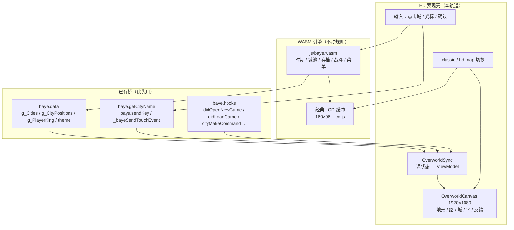

# 真·HD 大地图规格（已锁定）

本文是 **大地图（overworld）** 的产品与技术规格。它不是 CSS 2× 放大说明书——那一层见 [hd-graphics.md](hd-graphics.md)。  
规格与实现路径仍不替换 `dat.lib`、不伪造游戏截图。几何占位可继续用于未接线的层。

**素材现状（分支内）：** HD 视觉地理以 Wikimedia **China LCC topographic map - Without border**（Flappiefh / Augusta 89，CC BY-SA 4.0，eqdc）为**主参考**（见 `GEOGRAPHY.md` 与 [china-lcc-city-alignment.md](china-lcc-city-alignment.md)）。可玩底图是该 SVG **全幅、无南裁** 的 3840×3309 栅格（含海南 / 南海南沙一带；源图已无标注）。1080p 画布是可拖动摄像机窗口，开局对准中东部（西凉–襄平–建业–成都），**不把全国塞进一屏**。**城标按史实经纬度投影到全图地图坐标**，绘制 / 点选用 `map - camera`。建安郡国图仅作可选史实对照。引擎 ID / `g_CityPositions` 只用于规则与入城对齐。其它层仍是 AI 占位。**不是**步步高原作美术。  
**分支策略：本轨道只停在 `feature/hd-graphics`，在用户明确要求之前不要合入 `main`。**

状态：产品方向已锁定；史实向地形已进本分支。**P0–P3 已在本分支落地（P2 partial）**：P1 城态/点选仍在；P2 在地形与城标之间画路网。邻接来自 `g_CityPositions` 的格邻接（Chebyshev≤1），不是引擎出征表。关隘只标在路中点压到河叠加处。缺口见 §8–§9 与 FEATURES.md。

---

## 1. 目标 / 非目标

### 目标

- 优先画面：**大地图**。城池菜单、战斗、开局选君主等仍走原 WASM，可继续用经典 LCD。
- 视觉方向：**现代 2D 策略地图**（清晰分层、势力色、可读标注），不是「把 160×96 像素块放大」，不是水墨风，也不是照搬某款《三国志》商业作。
- 目标显示：**1080p 级铺满**。游戏区 / 布局按约 **1920×1080** 设计，在常见 1080p 窗口里铺满（可 `object-fit: contain` 到更大屏，避免拉伸变形）。
- 下列元素都要做成「精细的策略地图部件」，不能只靠邻近取样：
  1. 城池与势力色（标记、归属色、选中）
  2. 地形底图（山、河、平原等）
  3. 道路与连线（邻接、关隘）
  4. 地图文字（城名、年月、提示）
  5. 交互反馈（光标、高亮、入城/打开菜单的反馈）
- 规则、存档、时期、城池指令、战斗仍由原引擎负责。
- **经典 LCD 大地图必须可切回**（与现有 HD 脚手架同一哲学：可逆、默认不强迫）。

### 非目标（本轨道不做）

- 不重写整局游戏，不另开一套科技树 / 联机 / 抽卡。
- 不盲换、不重打包 `libs/*.lib` 图块。
- 不发明立绘、假游戏截图；占位 PNG 仅限 `assets/hd-overworld/` 清单路径，且可被用户替换。
- 不把战斗地图、城内菜单先做成 HD（那些是后续轨道）。
- 不把引擎逻辑分辨率改成 1920×1080——菜单坐标仍按原 16px 格。
- 手机竖屏虚拟键页不作为 P0 目标（PC 1080p 窗口优先）。

---

## 2. 已锁定的产品规格

| 项 | 锁定值 |
|----|--------|
| 优先画面 | 大地图 |
| 风格 | 现代 2D 策略地图 |
| 分辨率 | 约 1920×1080 游戏区，铺满典型 1080p 窗口 |
| 必须精细化的层 | 城池/势力色、地形、道路连线、文字、交互反馈 |
| 素材 | 分支内已有 AI 占位包 `assets/hd-overworld/`；用户可替换；**不合 main 直至用户明确合并** |
| 经典观感 | 始终可切换回去 |

词典原版大地图规模（引擎侧，已在本仓库验证）：**约 12×9 格、38 城**。HD 层一次展示**整张大地图**，不再用 160×96 窗口去「窥视」一小块。

---

## 3. 选定架构：HD 表现壳 + 原 baye WASM

### 为什么不用另外三条路

1. **只做 CSS / canvas 整数倍放大**  
   引擎逻辑 LCD 约 160×96。2×/6× 只能让色块变大，变不成现代 1080p 策略地图（城名仍是点阵、地形仍是 16px 瓦片）。[hd-graphics.md](hd-graphics.md) 的 1×/2× 只解决「原作更好认」，不是本轨道。
2. **盲换 `dat.lib` 图块**  
   图块管线仍受 16×16 与引擎绘制顺序限制；原作包版权敏感；Mod 一换就碎。即使用户给了高清图，也不该写进 `.lib` 当 v1。
3. **整游戏重写**  
   丢掉存档、时期、城池指令、战斗与现有 Mod 兼容。成本与风险都不可接受。

### 选定路径

**在原 WASM 引擎外包一层 HTML/CSS/Canvas（P0–P3 用 2D Canvas；P4 素材图集变多时可再评估 Pixi）的大地图表现层。**

1. WASM 继续管规则、存档、时期、城池指令、战斗等。
2. 新增 1080p **overworld presentation layer**，按现代策略地图来画。
3. 从引擎状态同步城池、归属、光标、日期；能走现有 `bridge.js` / `baye.data` / `baye.hooks` 就走；不够的字段只做探测记录，不改 WASM、不抹掉 GPL/MIT 版权声明。
4. 玩家在 HD 地图上的选择（点城、确认）回传给引擎；**v1 入城后仍打开经典城池菜单**（内政 / 外交 / 军备 / 状况）。
5. 经典 LCD 与 HD 地图可切换，默认保留经典可用。
6. 本提交**不要求新美术**，只定规格、清单与分期。

P0 不引入 Pixi / 其它渲染库：静态服务零新依赖。若 P4 图集与粒子明显吃力，再单独立项加 Pixi，接口仍读同一份 `OverworldViewModel`。

---

## 4. 分层示意



```
玩家看到的两种模式（可逆）

[经典]  现有 <canvas id="lcd"> + 1×/2× CSS     ← 默认，与 PR #2 脚手架一致
[HD地图] 全屏/铺满的 #hd-overworld（1080p）
         引擎 LCD 可隐藏或缩到角落作对照；菜单弹出时再显示经典 LCD
```

---

## 5. 显示与坐标

| 项 | 规格 |
|----|------|
| 设计分辨率 | 1920×1080 CSS 像素（1:1 位图，`devicePixelRatio` 为 2 时可画 3840×2160 再缩小，避免糊） |
| 铺满 | 外层 `width:100%; height:100%; object-fit: contain; background:#0e1116`，超 1080p 留边，不拉变形 |
| HUD | 顶栏约 56–64px：年/月、君主、提示；不挡城名 |
| 地图安全区 | 约 `(48, 72)` – `(1872, 1048)`，城点不得贴边 |
| 引擎格 | 原作约 12×9、城坐标来自 `g_CityPositions[i].x/y`（单位须运行时标定，见 §8） |
| 映射 | `hdX = padX + (engX - minX) / spanX * layoutW`（Y 同理）。P0 先用标定表，禁止猜偏移 |

城点最小间距在 1080p 上建议 ≥ 72px，避免点选打架。若原坐标过近，允许 **标签避让**（名牌偏移），城标锚点仍跟引擎坐标走。

---

## 6. 必须精细化的五层

绘制顺序（后画在上）：

1. **地形底图** — 平原底 + 山/林/河叠加。P0 用色块多边形；P2 换用户图层或矢量。不要把 `dat.lib` 16px 瓦片拉满 1080p 当成品。
2. **道路与连线** — 邻接城之间的曲线/折线；关隘用独立标记。线宽约 4–6px（普通）、8px（当前可达/出征预览，P3）。
3. **城池与势力色** — 每城一枚标记 + 归属色环/底。空城、己方、他方、选中四态。色相跟 `city.Belong`（君主人物 id）走，空为 `0`，俘虏为 `0xff`（与 `getPersonNameByID` 一致）。
4. **地图文字** — 城名（引擎 `getCityName(i)`）、顶栏年/月、短提示。HD 用 Web 字体，不把 LCD 点阵字拉大。
5. **交互反馈** — 悬停描边、选中脉动/光标、入城前闪一下再切经典菜单。反馈只画在壳上，不改引擎逻辑。

势力色：P1 用内置调色板（20+ 槽，按 `Belong` 哈希或先到先得）。用户可在 P4 丢 `palette/factions.json` 覆盖。`baye.data.theme.ownedCityColor` 等是给经典 LCD 用的，HD 壳不要直接拿 1-bit 色号当最终色。

---

## 7. 与引擎同步（已有钩子优先）

下列名称均来自本仓库 `js/bridge.js`、`js/examples.js`、`js/demos.js`，实现时以运行时 `baye.data` 为准。

### 7.1 已确认可读

| 用途 | 来源 |
|------|------|
| 城列表 | `baye.data.g_Cities[]`（长度即城数，词典原版 38） |
| 城名 | `baye.getCityName(i)` |
| 城坐标 | `baye.data.g_CityPositions[i].x` / `.y` |
| 归属 | `city.Belong`（0 空，`0xff` 俘虏，其它为君主人物 id） |
| 玩家君主 | `baye.data.g_PlayerKing`（demos 里 `playerKingId = g_PlayerKing + 1` 与 Belong 对齐） |
| 时期 | `baye.data.g_PIdx` |
| 城数值（HUD/Tooltip） | `Food` `Money` `Commerce` `PeopleDevotion` `State` 等（状况菜单已验证同类字段） |
| 经典地图主题色 | `baye.data.theme.landMapColor` / `ownedCityColor` / `emptyCityColor` / `otherCityColor` / `landCursorColor` |
| 新开局 / 读档 | `baye.hooks.didOpenNewGame` / `didLoadGame` |
| 入城指令点 | `baye.hooks.cityMakeCommand`（菜单已打开时） |
| 回传按键 | `sendKey(VK_*)`（`js/lcd.js`） |
| 回传点触 | `_bayeSendTouchEvent`（逻辑 LCD 坐标） |

### 7.2 输入怎么回传（v1）

HD 地图选城并确认后：

1. 把引擎光标对齐到该城（优先写已暴露的光标/当前城字段；没有则用方向键序列逼近，并在文档里记下这条退路）。
2. 再 `sendKey(VK_ENTER)`，打开**经典**城池菜单（四项主菜单不变）。
3. 菜单打开期间 HD 地图可暂停刷新或退到背景；关菜单（`VK_EXIT` 回到大地图）后壳再接管。

不要在 P0 重做内政/外交/军备 UI。

### 7.3 建议刷新节奏

- `requestAnimationFrame` 画反馈动画。
- 状态抽样：地图空闲时 4–10 Hz 读 `g_Cities` + 光标 + 日期。
- 在 `didOpenNewGame` / `didLoadGame` / 月份推进相关 hook（探测到就挂）强制全量刷新。

---

## 8. 还需探测、先不要猜死的字段

实现 P0/P1 前用 `pc.html` 控制台对「词典原版」跑一遍，把结果补进本节（不要改 WASM）。

| 缺口 | 为什么要 | 建议怎么探 |
|------|----------|------------|
| 年 / 月 | 顶栏「190年1月」 | 枚举 `baye.data` 里含 Year/Month/Date 的键；对照 LCD 已显示的年月 |
| 当前光标城 index | HD 选中框与引擎同步 | 找 `g_CityCrt` / `g_MapSX` 类字段，或移动一次方向键看谁变 |
| 城邻接 / 关隘 | 道路层 | 看 `city` 上是否有 Exit/Link 数组；没有就从出征/移动目标列表建邻接表，并缓存为 `docs` 旁的 JSON **草稿**（仍不是美术） |
| `g_CityPositions` 单位 | 映射 1080p | 打印 38 城 min/max，对照西凉等已知城 |
| 「正在大地图」 | 避免选君主/战斗时误开 HD 壳 | hook 或画面模式枚举；不确定时用「LCD 像大地图且 `g_Cities` 已有归属」作启发式，并允许用户手动切 |
| 地形底图数据 | P2 | 大地图是否另有地格数组（战场 `g_FightMap` **不是** 大地图）。没有就只用用户图层 + 几何占位 |

探测代码已进 `js/hd-overworld-probe.js`（只读，含深搜 Year/Month 与 `g_Cities[0]` 字段）。切到 HD 地图后第一次抽样会打印字段候选与 38 城坐标表。P1 浏览器跑词典原版后把结果补在下表。不要改 WASM。

| 探测项 | 词典原版运行时结果（P1） |
|--------|--------------------------|
| 年 / 月 | **已确认。** 字段是 `g_YearDate` / `g_MonthDate`（不是 `g_YearN`）。董卓弄权开局读到 **190 / 1**，与 LCD「190年1月」一致。HUD 只接受 184–220 / 1–12 |
| 当前光标城 | **无 `g_CityCrt`。** `g_CityX`/`g_CityY`/`g_FoucsX`/`g_FoucsY` **不是**大地图光标。词典原版方向键改的是 **`g_CityPos.setx` / `sety`**（西凉=1,0，安定=2,1），一次一格。**写这对字段读回会成功，但 ENTER 仍进原城**（西凉点安定曾进西凉菜单）。HD 只按 Δ 发方向键，对齐后再 `VK_ENTER`。`onMenuIdle` 确认菜单 |
| `g_CityPositions` 单位 | **格坐标仍在。** 38 城约 x 0–11、y 0–7，只供 WASM / 格走入城。HD 城标改走 `china-lcc-cities.json`（LCC eqdc 投影） |
| 玩家君主 | `g_PlayerKing` 开局张杨为 **9**（0-based）；城 `Belong` 为 **10**。`resolvePlayerBelong` 按城计数对齐。`getPersonNameByID(10)` → 张杨 |
| 「正在大地图」 | 仍用 `g_PIdx` 1–8 + 城有归属。本次开局 `g_PIdx=3` 但年是 190（董卓弄权），时期名映射不可靠，只当「在战役中」启发式 |
| 城邻接 / 关隘 | **无引擎邻接字段。** 词典原版 `g_Cities[0]` 字段为 Farming/Commerce/Food/Belong/SatrapId/PeopleDevotion/PersonQueue/ToolQueue 等，无 Exit/Link。`SearchRoad` 等未导出（`wasmRoadExported=false`）。运行时 Chebyshev≤1 得 **67** 条边；过河关隘 **5**（史实向河线更细，旧占位河曾为 10）；城 30 云南孤立。见 `roads/adjacency.json` |

---

## 9. 分期计划

| 阶段 | 内容 | 美术 | 玩家能看到 |
|------|------|------|------------|
| **P0** | 1080p 容器、`classic` / `hd-map` 切换、读 manifest 合成地形、按引擎坐标（或临时表）放城标、点城回传经典菜单 | 用分支内占位 PNG；缺则几何 | 能切到地形+城；点城尽力打开经典菜单；默认可切回 |
| **P1** | 城标四态、势力色、城名、年月（探测到就上）、点击选城、回车开经典菜单 | 用 `cities/marker_*.png` + `palette/factions.json` | 能玩：HD 选城 → 经典菜单 |
| **P2** | 地形色带/图层、道路折线、关隘标记 | 用户未到则继续几何 | 像地图而不像点阵放大 |
| **P3** | 光标、悬停、选中、入城闪白/缩放、可达邻接高亮 | 程序化已做；自定义光标跳过 | 反馈可见（邻路=P2 图） |
| **P4** | 按清单换上素材；`manifest.json` 对得上才换，缺项回退占位 | 先用分支内 AI 占位包；用户可覆盖同路径 | 真 HD 外观；对不上的层不硬上 |

P0 开关（已实现）：

- `localStorage['baye/overworldMode']` = `classic`（默认）\| `hd-map`
- 写入：`pc.html` 画质条「经典地图 / HD 地图」、首页「大地图」下拉、`BayeHdOverworld.setMode`
- 与现有 `baye/lcdCssScale` 独立：经典模式下 1×/2× 仍有效；HD 地图模式下 CSS 2× 不再作用于大地图本身。

实现文件：`js/hd-overworld.js`、`js/hd-overworld-probe.js`、`css/hd-overworld.css`。探测脚本只读，开 HD 后第一次抽样会 `console.log` / `console.table` 城坐标与候选字段。

P0 诚实缺口：

- 坐标：有 `g_CityPositions` 时用 min–max 线性映射到安全区，**还不是**手调标定表。控制台有每城 `eng → hd` 日志。
- 年月 / 当前城：按 `g_YearN` `g_MonthN` `g_CityCrt` 等候选名探测；对不上就空着，不猜死。
- 「正在大地图」：启发式（`g_PlayerKing` 有效且城有归属）+ `cityMakeCommand` / `willCloseMenu`。选君主「势力形势图」可能被当成地图，LCD 会缩到角落；切回经典即可。
- 点击入城：写已暴露的光标字段 → 方向键逼近 → 可见格上 `_bayeSendTouchEvent` → `sendKey(VK_ENTER)`。字段不足时可能对不齐目标城，**完整玩法请切回经典键操**。
- 道路 / 关隘已按格邻接落地（P2 partial）；P3 用同一张表做可达邻接高亮。

完成标准：

- P0：默认经典与现在 PR #2 无回归；切 HD 不崩溃；切回经典 LCD 仍能键操。 **此项已做。**
- P1：归属色随 `Belong` 变；点己方可入城出菜单。 **己方当前城已验证。跨城：词典原版马腾 西凉→安定、安定→天水 菜单城名正确（tile-walk RD）。**
- P3：悬停/选中/入城闪/邻路高亮可见；自定义光标跳过。 **词典原版马腾 190年1月已核验：悬停安定亮环、西凉邻路加亮、点西凉 150ms 闪后开四项菜单。**

P1 已实现：

- 四态：`empty`（Belong 0 / 0xff）/ `owned`（`Belong` 对齐 `g_PlayerKing`，运行时按城计数 +0/+1）/ `neutral`（其它势力，色环按 `factions.json` 24 槽哈希）/ `selected`（`marker_selected` + 脉动）
- 城名：`getCityName(i)`，20px 暗底+描边，纵向避让
- 悬停：浅色描边；菜单期关掉 HD 命中；点地图空白或关菜单后壳再接管
- 点城：已在目标城则只发 `VK_ENTER`。跨城：按 `g_CityPos` 格走方向键（不盲写）。对齐失败不发 ENTER。控制台有 `align 西凉(0) → 安定(3) method=tile-walk`
- 年月：读 `g_YearDate` / `g_MonthDate`；董卓弄权开局 HUD「190年1月」

P1 诚实缺口：

- 无城 index 字段。词典原版用 `g_CityPos.setx/sety` 做格光标；其它 lib 若没有这对字段，回退 P2 邻接 BFS，仍可能对不齐 → 切回经典。对齐失败会 timeout 留在 HD，不挂死
- 选君主形势图仍可能被当成大地图（P0 启发式未改）。`g_PIdx` 开局读到 3，不能当时期名
- 己方色环比 P0 明显，但占位塔楼本身仍偏灰，主要靠色环区分势力
- P2：路网按格邻接画，**不是**出征可达全集。隔一格的历史官道（若有）会缺。无引擎关隘字段。
- P4：缺文件时该层自动占位，不 404 卡死。

P2 已实现：

- 绘制顺序：地形（中国 LCC 全图竖裁 + 提取河）→ 路（史实近邻，5px 土色二次曲线）→ 城标/势力 → 城名 → 悬停/选中/入城闪（P3）。城标 HD 坐标来自 `china-lcc-cities.json`
- 邻接优先读城对象 Exit/Link；没有则用 `adjacency.json` 里写死的边；再没有则运行时 Chebyshev≤1
- 当前词典原版走 LCC 近邻：`source=lcc-neighbors`。`stroke.png`（64×16 土色）作 pattern，不行就纯色
- 关隘：`pass.png` 只放在路中点压到河、且两端城不在河上的边上（过河）。山 overlay 误报太多，不单独标关

P2 诚实缺口：

- 未调用 `SearchRoad`（需改 WASM 导出）
- 格上不相邻的城没有路，避免臆造全连接
- 关隘是 overlay 启发式，不是引擎关隘数据。史实向河叠加更细后，词典原版过河关从 10 降为 **5**

P3 已实现：

- 悬停：程序化亮环（约 3.5px `#fff8d2` + 外晕）+ 城名加粗金色；HUD 右栏写「悬停 {名}」。不用 `ui/cursor_hover.png`
- 选中：保留 `marker_selected`，外环 rAF 脉动（半径 32±5，约 180ms 正弦）
- 入城：点城后 150ms 白闪 + 微缩放（正弦包络），再 160ms 走 `alignAndEnter`（`g_CityPos` 写字段 / 格走 / 邻接 BFS）
- 可达邻接：从 `selected` / 引擎光标 / `guessCurrentCity` 取焦点城，把 P2 已有边上接到该城的路加亮（10px 浅金晕 + 8px `#f0c75a`）；邻城细金环。不新建图
- 光标策略：`cursorPolicy='os-pointer'`。CSS `cursor:pointer`。不画 `ui/cursor.png`
- 绘制顺序与菜单期关 HD 命中沿用 P1（`hitsEnabled` = hd-map + map + !aligning）

P3 诚实缺口：

- **自定义光标跳过。** `assets/hd-overworld/ui/cursor.png` 是黄箭头，叠在系统指针上会重影；`cursor_hover.png` 像禁止/取消符，当悬停反馈会误导。悬停改程序化描边
- 邻接高亮用的是 P2 Chebyshev≤1 边，**不是**引擎 `SearchRoad` 出征可达
- 引擎仍无当前城 index；焦点城可能是上次点选或「第一座己方城」猜测，邻路高亮可能偏
- 入城闪是 Canvas 程序化，没有独立入城动画素材

---

## 10. 用户素材清单

投放根目录（**已在本分支落地**）：

`assets/hd-overworld/`

当前仓库里的是 **AI 占位包**（见该目录 `README.md` 与 `manifest.json`），用于对路径、尺寸和分层。它不是步步高原作美术，也不是成品关卡截图。用户可直接替换同名文件；缺文件的层仍回退几何占位。  
**政策：素材只跟 `feature/hd-graphics` 走，用户未明确合并前不要进 `main`。**

所有位图：**PNG-24 + alpha**（或 WebP 无损/高质量），sRGB。矢量可用 SVG，但要提供 PNG 后备。不要用原作 `.lib` 里扒出来的图当「用户新美术」除非用户明确授权。

### 10.1 `manifest.json`（P4 必填）

```json
{
  "designWidth": 1920,
  "designHeight": 1080,
  "style": "modern-2d-strategy",
  "version": "1",
  "layers": {
    "terrain": ["terrain/base_plains.jpg", "terrain/overlay_mountains.png", "terrain/overlay_rivers.png", "terrain/overlay_forest.png"],
    "roads": { "stroke": "roads/stroke.png", "pass": "roads/pass.png" },
    "cities": {
      "empty": "cities/marker_empty.png",
      "neutral": "cities/marker_neutral.png",
      "owned": "cities/marker_owned.png",
      "selected": "cities/marker_selected.png"
    },
    "ui": { "cursor": "ui/cursor.png", "cursorHover": "ui/cursor_hover.png" },
    "palette": "palette/factions.json"
  }
}
```

文件名必须对得上；多出来的文件可以忽略，少了的层用占位。

### 10.2 尺寸与命名

| 资产 | 路径 | 尺寸 | 说明 |
|------|------|------|------|
| 平原底 | `terrain/base_plains.jpg` | 3840×3309（全 SVG） | 最底层；视口是 1920×1080 摄像机，可拖动 |
| 山 | `terrain/overlay_mountains.png` | 与底图同范围或占位 | 透明叠加；当前关隘检测用，可不绘制 |
| 河 / 湖 | `terrain/overlay_rivers.png` | 与底图同范围 | 透明叠加；当前关隘检测用，河已在底图上 |
| 林 | `terrain/overlay_forest.png` | 与底图同范围或占位 | 透明叠加 |
| 可选地格 | `terrain/tileset.png` | 网格 128×128，每格一种 | 仅当不用整屏图层时 |
| 路笔刷 | `roads/stroke.png` | 高 16 或 32、可横向平铺 | 程序沿线刷；没有则用纯色描边 |
| 关隘 | `roads/pass.png` | 48×48 或 64×64 | 锚点中心 |
| 空城 | `cities/marker_empty.png` | 64×64 | 锚点中心；选中可用 96×96 的 `marker_selected` |
| 他方 | `cities/marker_neutral.png` | 64×64 | 再乘势力色或留可染色的灰模 |
| 己方 | `cities/marker_owned.png` | 64×64 | |
| 选中 | `cities/marker_selected.png` | 96×96 | |
| 光标 | `ui/cursor.png` | 48×48 | |
| 悬停光标 | `ui/cursor_hover.png` | 48×48 或 72×72 | |
| 顶栏条（可选） | `ui/hud_panel.png` | 1920×64 | 没有则 CSS 半透明条 |
| 字体（可选） | `fonts/ui.woff2` | CJK | 缺则用现有 `fonts/HarmonyOS_Sans_SC_*.ttf` |
| 势力色 | `palette/factions.json` | 见下 | |

城标若做成「灰模 + 可乘色」，请保证非染色部分（石墙、描边）在单独通道或约定不乘色区域。否则势力色会把整座城染脏。

### 10.3 `palette/factions.json`

```json
{
  "empty": "#8a8f98",
  "player": "#3d8bfd",
  "byBelongId": {
    "1": "#c43c3c"
  },
  "fallback": ["#e0a14a", "#5cb87a", "#9b6bdb", "#d97b3e", "#4aa3a3"]
}
```

`byBelongId` 的键是引擎 `Belong`（人物 id），不是城 index。

### 10.4 文字与反馈（可不供图）

| 用途 | 规格 | 无素材时 |
|------|------|----------|
| 城名 | 18–22px，描边或暗底牌，居中于城标下方 8–12px | `HarmonyOS_Sans_SC` |
| 年月 | 24–28px，顶栏左 | 同上 |
| 提示 | 16–18px，顶栏右或底 | 同上 |
| 悬停 | 1.5–2px 亮边 + 名称加粗 | 程序化 |
| 选中 | 外环或 `marker_selected` | 程序化圆环 |
| 入城 | 120–180ms 闪白/微缩 | 程序化 |

不要提供「游戏已做成这样」的假截图当素材。

---

## 11. 风险与未决问题

| 风险 | 处理 |
|------|------|
| 邻接表引擎未暴露 | P2 用出征/移动目标建表，或用户给一份 `roads/adjacency.json`（城 index 对） |
| 坐标单位不明 | P0 只画点并打印标定；映射表单独提交 |
| 菜单期误把点击送给 HD 层 | 明确「模式」：`map` / `classic-menu` / `other`；菜单期关掉 HD 命中 |
| 1080p 在小笔记本上裁切 | contain + 内部滚动禁用；低于 1280×720 建议回经典 |
| 用户美术风格漂移（水墨/像素） | 清单写明 modern-2d-strategy；不合层就回退占位 |
| 版权 | 不把原作瓦片当 HD 素材；用户素材需其自己有权 |
| 手机 | 非 P0；横屏以后再 contain，不做竖屏 2× |
| 战斗/菜单 HD | 另一轨道，避免本图膨胀 |

未决（不阻塞写规格，阻塞 P1/P2 编码）：

1. 年/月、当前城、邻接的准确 `baye.data` 字段名。
2. HD 地图打开时经典 LCD 是隐藏、缩到左下 480×288，还是只在菜单时弹出（建议：**地图期隐藏 LCD，菜单期弹出经典 LCD**）。
3. 是否允许用户提供一张手绘整图底图代替分层地形——允许，但城点仍必须按全图地图坐标叠，不能「画死」38 城在视口像素上却对不齐归属。

---

## 12. 和现有 HD 脚手架的关系

| 文件 | 角色 |
|------|------|
| [hd-graphics.md](hd-graphics.md) / `js/hd-graphics.js` | 经典 LCD 的 1×/2×、锐利/平滑、外壳主题 |
| **本文** | 真 HD 大地图的下一产品轨道 |
| `js/hd-overworld.js` / `css/hd-overworld.css` | P0–P3 表现壳（本分支已建立） |
| `js/hd-overworld-probe.js` | 只读探测年月 / 光标 / 城坐标 |

两套开关并存，互不覆盖。没有用户美术时，**不得**把 CSS 2× 说成「已经是现代策略大地图」。

---

## 13. 许可证

不改 `LICENSE`（GPL-2.0 前端）与 `LICENSE.ENGINE`（MIT）。表现壳是后加的 JS/CSS，沿用仓库前端许可。游戏数据与原作美术版权仍归原厂商。  
分支内 `assets/hd-overworld/` 是 AI 占位图，**不是**原作/步步高美术；用户替换后的文件版权归提供方。本仓库不把占位包说成成品原画。
